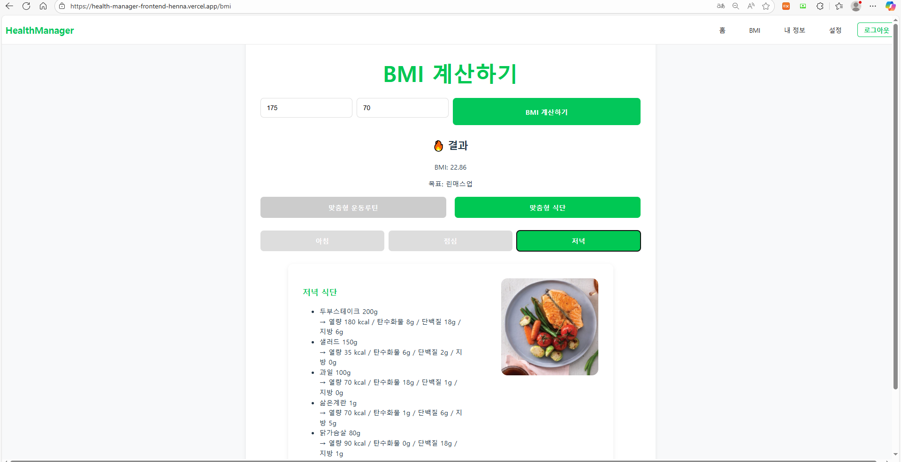

# 🏋️‍♂️ Health Manager
React + Spring Boot 기반 **BMI 계산 / 운동 루틴 / 식단 추천 / JWT 인증** 헬스 관리 서비스

---

## 📌 프로젝트 소개
Health Manager는 사용자가 **키와 체중을 입력하면 BMI를 계산**하고  
그에 맞춰 **운동 루틴과 식단을 자동 추천**해주는 웹 서비스입니다.

- 프론트엔드와 백엔드를 완전 분리한 구조(MSA 느낌)
- JWT 기반 로그인 인증
- Postman을 통한 API 검증
- MySQL 기반 사용자 관리


---

## 🚀 주요 기능 요약

### 🔐 인증(Authentication)
- 회원가입
- 로그인(JWT 발급)
- 인증 사용자만 메인 페이지 접근 가능

### 📊 BMI 계산
- `height`, `weight` 입력 후 자동 BMI 계산
- BMI 구간에 따라 “벌크업 / 린매스업 / 다이어트” 목표 자동 분류

### 🏋️ 운동 루틴 추천
- 3분할 Day1/Day2/Day3 구성
- 목표에 따라 운동 강도 및 부위 자동 추천

### 🍽️ 식단 추천
- 아침 / 점심 / 저녁 구성
- 총 칼로리 포함

---

## 🧱 기술 스택

### 🔸 Frontend
<p>
  
  
  
  
</p>

### 🔸 Backend
<p>
  
  
  
  
</p>

### 🔸 Database
<p>
  
  
</p>

### 🔸 Tools
<p>
  
  
  
  
  
  
</p>


## 🏗️ 전체 아키텍처

```yaml
architecture:
  client:
    name: "User(Client)"
    action: "웹 브라우저로 서비스 접속"
  
  frontend:
    name: "React Frontend"
    actions:
      - "화면 UI 렌더링"
      - "Axios로 Backend API 호출"
      - "JWT를 localStorage에 저장하여 인증 상태 유지"

  backend:
    name: "Spring Boot Backend"
    components:
      - "Controller"
      - "Service"
      - "Repository"
      - "Spring Security (JWT Filter)"
    actions:
      - "로그인 시 JWT 생성 및 검증"
      - "BMI 계산 처리"
      - "운동/식단 데이터 제공"

  database:
    name: "MySQL Database"
    actions:
      - "회원 정보 저장"
      - "JPA로 DB 연동"


---

## 🌐 동작 흐름

1. 사용자가 React UI에서 로그인/회원가입
2. 백엔드(Spring Boot)가 JWT 생성 후 반환
3. 프론트는 JWT를 localStorage에 저장
4. BMI 계산 요청 시 Axios가 JWT 포함해서 API 호출
5. 백엔드는 BMI + 운동 + 식단 추천 결과 반환

---

## 📸 화면 미리보기

### 🔐 로그인 페이지


---
### 📝 회원가입 페이지


---

### 🏠 메인 페이지


---

### 📊 BMI 계산 페이지


---

### 🍽️ 맞춤 식단 페이지



---

## 🔌 실행 방법

### ✔ Backend 실행
cd backend
./gradlew bootRun

shell
코드 복사

### ✔ Frontend 실행
cd frontend
npm install
npm run dev

yaml
코드 복사

---

## 🧪 API 테스트
Postman 또는 브라우저로 테스트 가능.

예시:
POST /user/login
POST /user/create
GET /health/status?height=175&weight=75

yaml
코드 복사

---

## 📦 배포(예정)
- Docker 기반 컨테이너 구성 예정
- Render 또는 AWS EC2 배포 예정
- GitHub Actions로 자동 빌드 예정

---

## 👨‍💻 개발자
**윤찬열(Backend + Frontend Full)**  
- 프론트 UI 개발  
- Spring Boot API 개발  
- JWT 인증 및 DB 설계  
- 아키텍처 설계 / 테스트 / 디버깅  

---

## 📚 기타
backend/README.md → API/DB/JWT 상세  
frontend/README.md → 페이지·라우팅·Axios 상세

---
=======
🏋️‍♂️ Health Manager
React + Spring Boot 기반 BMI 계산 / 운동 루틴 / 식단 추천 / JWT 인증 헬스 관리 서비스

📌 프로젝트 소개
Health Manager는 사용자가 키와 체중을 입력하면 BMI를 계산하고
그에 맞춰 운동 루틴과 식단을 자동 추천해주는 웹 서비스입니다.

프론트엔드와 백엔드를 완전 분리한 구조(MSA 느낌)
JWT 기반 로그인 인증
Postman을 통한 API 검증
MySQL 기반 사용자 관리
🚀 주요 기능 요약
🔐 인증(Authentication)
회원가입
로그인(JWT 발급)
인증 사용자만 메인 페이지 접근 가능
📊 BMI 계산
height, weight 입력 후 자동 BMI 계산
BMI 구간에 따라 “벌크업 / 린매스업 / 다이어트” 목표 자동 분류
🏋️ 운동 루틴 추천
3분할 Day1/Day2/Day3 구성
목표에 따라 운동 강도 및 부위 자동 추천
🍽️ 식단 추천
아침 / 점심 / 저녁 구성
총 칼로리 포함
🧱 기술 스택
🔸 Frontend
   

🔸 Backend
   

🔸 Database
 

🔸 Tools
     

🏗️ 전체 아키텍처
architecture:
  client:
    name: "User(Client)"
    action: "웹 브라우저로 서비스 접속"
  
  frontend:
    name: "React Frontend"
    actions:
      - "화면 UI 렌더링"
      - "Axios로 Backend API 호출"
      - "JWT를 localStorage에 저장하여 인증 상태 유지"

  backend:
    name: "Spring Boot Backend"
    components:
      - "Controller"
      - "Service"
      - "Repository"
      - "Spring Security (JWT Filter)"
    actions:
      - "로그인 시 JWT 생성 및 검증"
      - "BMI 계산 처리"
      - "운동/식단 데이터 제공"

  database:
    name: "MySQL Database"
    actions:
      - "회원 정보 저장"
      - "JPA로 DB 연동"


---

## 🌐 동작 흐름

1. 사용자가 React UI에서 로그인/회원가입
2. 백엔드(Spring Boot)가 JWT 생성 후 반환
3. 프론트는 JWT를 localStorage에 저장
4. BMI 계산 요청 시 Axios가 JWT 포함해서 API 호출
5. 백엔드는 BMI + 운동 + 식단 추천 결과 반환

---

## 📸 화면 미리보기

### 🔐 로그인 페이지


---

### 📝 회원가입 페이지


---

### 🏠 메인 페이지


---

### 📊 BMI 계산 페이지


---

### 🍽️ 맞춤 식단 페이지


---

## 🔌 실행 방법

### ✔ Backend 실행
cd backend
./gradlew bootRun

shell
코드 복사

### ✔ Frontend 실행
cd frontend
npm install
npm run dev

yaml
코드 복사

---

## 🧪 API 테스트
Postman 또는 브라우저로 테스트 가능.

예시:
POST /user/login
POST /user/create
GET /health/status?height=175&weight=75

yaml
코드 복사

---

## 📦 배포(예정)
- Docker 기반 컨테이너 구성 예정
- Render 또는 AWS EC2 배포 예정
- GitHub Actions로 자동 빌드 예정

---

## 👨‍💻 개발자
**윤찬열(Backend + Frontend Full)**  
- 프론트 UI 개발  
- Spring Boot API 개발  
- JWT 인증 및 DB 설계  
- 아키텍처 설계 / 테스트 / 디버깅  

---

## 📚 기타
backend/README.md → API/DB/JWT 상세  
frontend/README.md → 페이지·라우팅·Axios 상세

---


