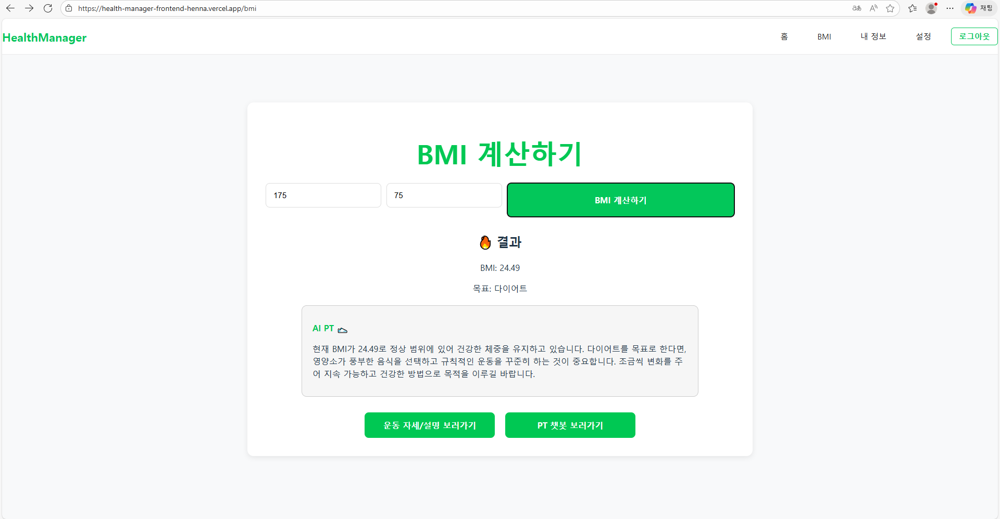
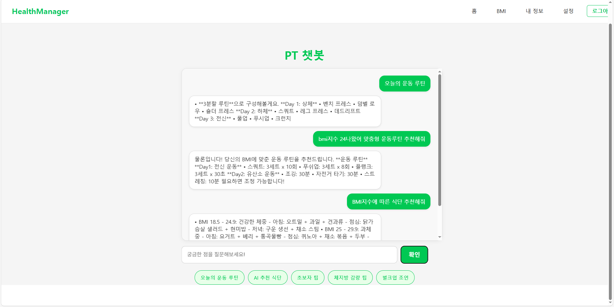
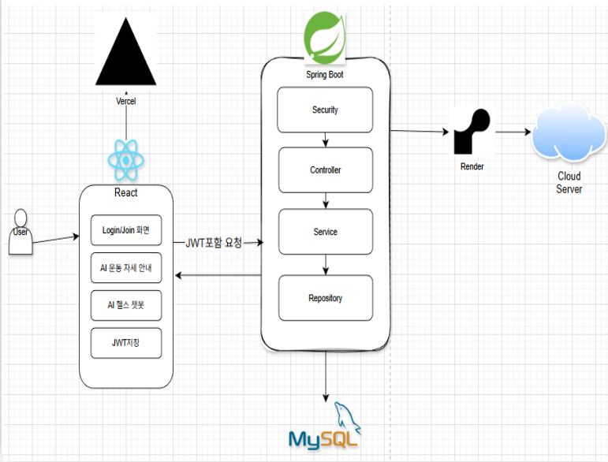

#  Health Manager
React + Spring Boot 기반 **BMI 계산 / 운동 루틴 /  헬스 관리 서비스

---

## 📌 프로젝트 소개
Health Manager는 사용자가 **키와 체중을 입력하면 BMI를 계산**하고  
그에 맞춰 **운동 루틴을 자동 추천**해주는 웹 서비스입니다.

- JWT 기반 로그인 인증
- OpenAI API호출을 이용한 헬스챗봇 개발
- MySQL 기반 사용자 관리
- 백엔드+프론트엔드 구조의 풀스택 시스템 

---

### 🔐 로그인 페이지

---
### 📝 회원가입 페이지

---

### 🏠 메인 페이지

---

### 📊 BMI 계산 페이지

---

### 🍽️ AI챗봇

---

## 주요 기능 요약

### 인증(Authentication)
- 회원가입
- 로그인(JWT 발급)
- 인증 사용자만 메인 페이지 접근 가능

### 챗봇
- OpenAI API호출을 이용한 조언과 챗봇시스템

###  BMI 계산
- `height`, `weight` 입력 후 자동 BMI 계산
- BMI 구간에 따라 “벌크업 / 린매스업 / 다이어트” 목표 분류

### 운동 루틴 추천
- 목표에 따라 운동 강도 및 부위 자동 추천

---

## 기술 스택

### 🔸 Language

  

### 🔸 Backend

  
  
  
  
  
  

### 🔸 Infra / DB

  
  

### 🔸 ETC

  

---

###  아키텍처

---

## 🌐 동작 흐름

1. 사용자가 React UI에서 로그인/회원가입
2. 백엔드(Spring Boot)가 JWT 발급
3. 프론트엔드는 JWT를 포함하여 API 요청
4. Spring Security에서 JWT 검증
5. 백엔드는 BMI 계산 및 OpenAI API호출 후 사용자조언
6. 챗봇 요청 시 캐시 확인 후 OpenAI API 호출
7. 결과를 프론트엔드로 반환

---

## 트러블 슈팅

### 1️⃣ 동일 요청에 대한 불필요한 OpenAI API 호출 문제

**문제**
- 챗봇 기능에서 동일한 질문에 대해서도 매번 OpenAI API를 호출
- 응답 지연 및 불필요한 API 비용 발생

**해결**
- 사용자 질문을 기준으로 캐싱 방식 적용
- 동일 요청이 들어올 경우 OpenAI API를 호출하지 않고 캐시된 응답 반환

**성과**
- 불필요한 OpenAI API 호출 제거
- 응답 속도 평균 약 2000ms -> 200ms 개선 및 API 비용 절감

---

### 2️⃣ Render 서버 Sleep 상태로 인한 초기 응답 지연 문제

**문제**
- Render 저가형 플랜 특성상 일정 시간 미사용 시 서버가 Sleep 상태로 전환
- 첫 요청(로그인 및 회원가입) 시 서버 기동으로 인해 1분 이상 응답 지연 발생

**해결**
- UptimeRobot을 활용해 서버에 주기적 요청 전송
- 서버가 Sleep 상태로 진입하지 않도록 유지

**성과**
- 첫 요청 응답 시간 약 1분 이상 → 3초 이내로 단축
- 사용자 체감 성능 및 서비스 안정성 개선
  
---

## 배포
- Frontend: Vercel
- Backend: Render

