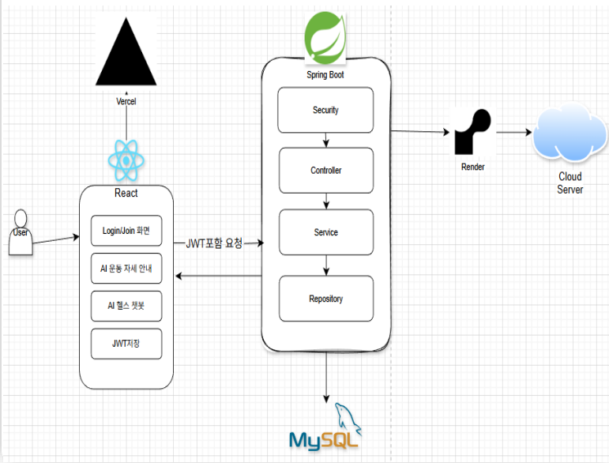
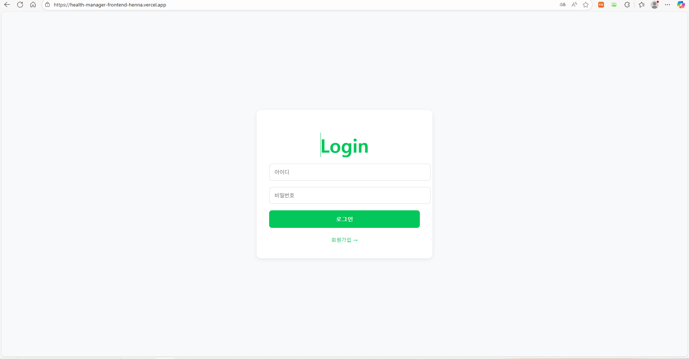
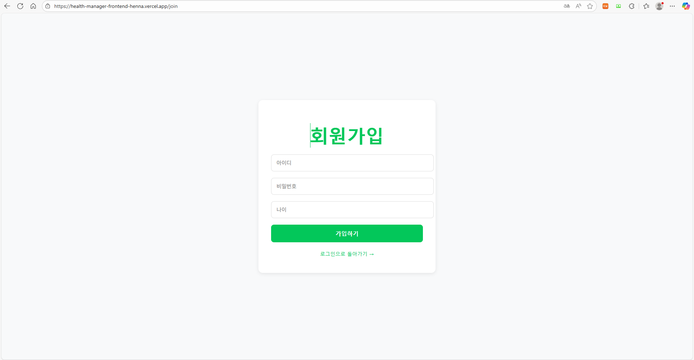
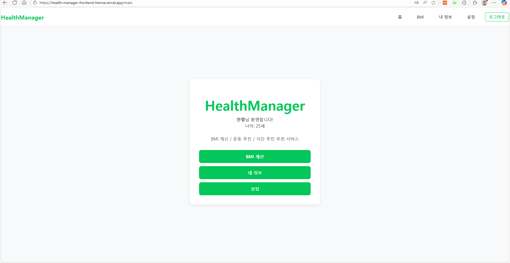
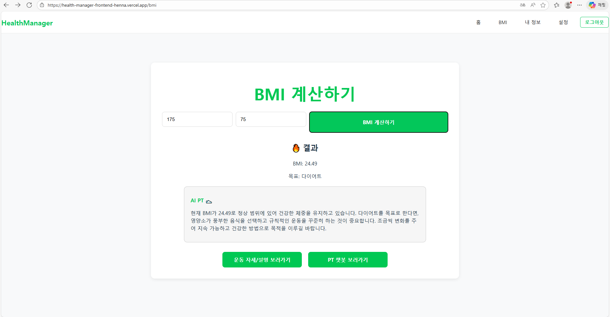
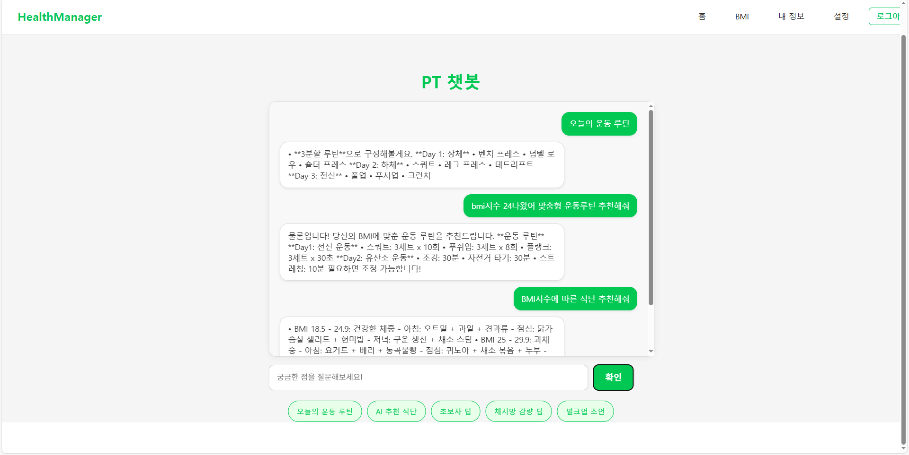

# 💪 Health Manager (1인 개발)

> BMI 기반 운동 추천 + AI 헬스 챗봇 서비스

---

# 📑 목차

- [프로젝트 소개](#intro)
- [기술 스택](#stack)
- [주요 기능](#feature)
- [시스템 아키텍처](#arch)
- [핵심 구현 및 성능 개선](#core)
- [서비스 화면](#ui)
- [트러블슈팅](#trouble)
- [회고](#review)

---

# 프로젝트 소개 

Health Manager는 사용자의 **키와 체중 데이터를 기반으로 BMI를 계산하고**,  
목표(벌크업 / 린매스업 / 다이어트)에 맞는 운동 루틴을 추천하는 웹 서비스입니다.  

또한 OpenAI API를 활용한 **AI 헬스 챗봇 기능**을 통해  
사용자에게 맞춤형 운동 및 건강 조언을 제공합니다.  

- JWT 기반 인증 시스템 적용
- OpenAI API 기반 AI 챗봇
- 사용자 맞춤형 운동 추천 시스템

---

# 기술 스택 

## 🔸 Backend

  
  
  
  
  
  

## 🔸 Frontend

  

## 🔸 Infra / DB

  
  
  
  

---

# 주요 기능 

- JWT 기반 회원가입 / 로그인
- BMI 계산 및 목표 자동 분류
- 목표 기반 운동 루틴 추천
- OpenAI 기반 AI 헬스 챗봇
- 사용자 정보 관리

---

# 시스템 아키텍처 

  

### 1. React → Spring Boot
로그인 이후 헤더에 JWT를 포함한 API 요청 전송  

### 2. Spring Security (JWT 검증)
인증 필터(JWT Filter)를 통해 사용자 인증 처리  

### 3. 컨트롤러는 HTTP요청처리, 실제 비즈니스 로직은 Service계층에서 처리
BMI 계산 및 목표 분류  

### 4. OpenAI API 호출
챗봇 요청 시 AI 응답 생성 후 Service계층에서 응답데이터 가공 후 Controller로 전달

### 5. Cache 처리
동일 요청 시 캐시된 응답 반환  

### 6. Database 저장
데이터 저장/조회 필요시 Repository 호출 후 사용자 정보 및 결과 저장  

---

# 핵심 구현 및 성능 개선 

### 1. JWT 기반 인증 시스템

- Stateless 구조의 JWT 인증 방식 적용  
- Spring Security 필터 체인을 통해 요청마다 토큰 검증  

**결과**
- 서버 세션 제거로 확장성 확보  
- 인증 처리 일관성 유지  

### 2. BMI 기반 비즈니스 로직 구현

- 사용자 입력(height, weight)을 기반으로 BMI 계산  
- BMI 구간에 따라 벌크업 / 린매스업 / 다이어트 자동 분류  

**결과**
- 사용자 맞춤형 운동 방향 자동 설정  

### 3. OpenAI 기반 챗봇 시스템

- 사용자 질문을 기반으로 AI 응답 생성  
- 운동 및 식단 관련 자연어 처리  

**결과**
- 사용자UX를 고려한 AI 기반 서비스로 확장  

### 4. 캐싱을 통한 OpenAI API 호출 최적화

- 동일 질문에 대해 매번 API 호출 발생 문제 확인  
- 질문을 key로 사용하는 캐싱 전략 적용  

**결과**
- 응답 속도: 약 2000ms → 200ms 개선  
- API 비용 절감  

### 5. K6 부하 테스트를 통한 서버 안정성 검증

- K6를 활용하여 동시 사용자 200명 환경에서 부하 테스트 수행  
- 로그인, BMI 계산, 챗봇 API를 대상으로 테스트 진행  

**결과**
- 평균 응답 시간 안정적으로 유지  
- 에러율 0% 수준 유지  
- 트래픽 증가 상황에서도 서버 안정성 확인  

### 6. JPA 기반 데이터 접근 및 DB 설계

- Spring Data JPA를 활용하여 ORM 기반 데이터 처리 구현  
- Hibernate를 통해 객체와 테이블 간 매핑 자동화  
- MySQL 환경에서 동일한 Entity 구조 유지  
- 보안을 고려하여 DB 비밀번호 및 OpenAI API Key를 코드에 직접 작성하지 않고 환경변수로 관리
- 
**결과**
- 반복적인 SQL 작성 감소  
- 유지보수성 및 개발 생산성 향상  
- DB 변경에도 유연한 구조 확보

---

---

# 서비스 화면 

## 🔐 로그인 페이지

---

## 📝 회원가입 페이지

---

## 🏠 메인 페이지

---

## 📊 BMI 계산 페이지

---

## 🍽️ AI 챗봇

---

# 트러블슈팅 

### 1. OpenAI API 중복 호출 문제

- **문제**  
  동일 질문에도 매번 API 호출 발생  

- **원인**  
  응답을 저장하지 않는 구조  

- **해결**  
  질문 기반 캐싱 적용  

- **결과**  
  응답 속도 개선 및 비용 절감  

---

### 2. Render 서버 Sleep 문제

- **문제**  
  첫 요청 시 서버 기동으로 인한 지연 발생  

- **원인**  
  저가형 배포 환경 특성  

- **해결**  
  UptimeRobot을 통한 주기적 요청  

- **결과**  
  응답 속도 개선  

---

# 회고 

단순한 BMI 계산 서비스를 넘어,  
AI 기반 챗봇과 성능 최적화를 적용하며  
서비스의 완성도를 높였다.  

특히 캐싱을 통한 성능 개선 경험을 통해  
백엔드에서의 효율적인 리소스 관리의 중요성을 이해할 수 있었다.  

또한 JWT 기반 인증 구조를 구현하며  
Stateless 아키텍처 설계 경험을 쌓을 수 있었다.

